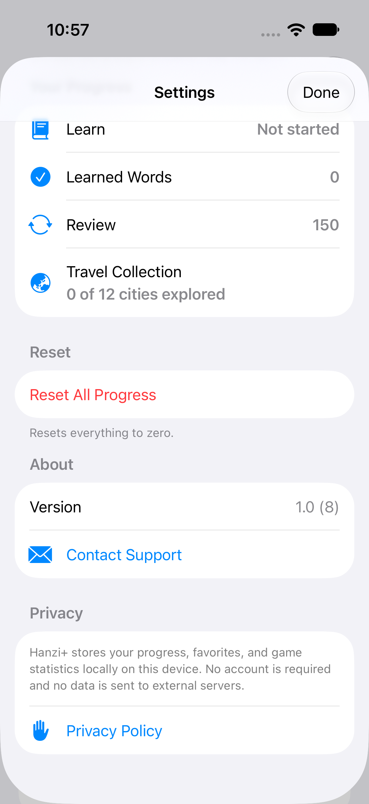

<p align="center">
  
</p>

<h1 align="center">Hanzi+</h1>

<p align="center">
  Learn Mandarin Chinese a little every day: lessons, flashcards, games and travel phrases with pronunciation.<br>
  A fully offline iPhone app built with SwiftUI.
</p>

<p align="center">
  <a href="https://ayoleynikov.github.io/hanziPlus/">Website</a> ·
  <a href="https://ayoleynikov.github.io/hanziPlus/privacy.html">Privacy Policy</a>
</p>

<p align="center">
  
  
  
  
</p>

---

## Features

- **Today plan.** A daily study plan with a daily lesson, progress and streaks.
- **Guided course.** 15 lessons split into chapters, with vocabulary, dialogues, grammar cards, a tone guide, quizzes and mistake review.
- **Flashcards & study sets.** HSK 1–3 word lists plus themed sets (daily life, food, travel, business, culture, technology). Mark words as learned and search the dictionary.
- **Smart review.** Spaced review of the words you've learned.
- **Games.** Match Pairs, Speed Challenge, Sentence Builder, Listening Quiz, Hanzi Memory, Find the Hanzi, Typing Challenge, plus a Daily Challenge.
- **Journey.** Unlock 12 Chinese cities and their attractions as you learn.
- **Travel toolkit.** Ready-to-use phrases by situation, a "show to a local" view and one-tap copy of the Chinese text.
- **Pronunciation.** Chinese is read aloud with Apple's on-device speech synthesis.
- **4 interface languages.** English, Spanish, Portuguese (Brazil) and Russian, switchable in the app.
- **Private by design.** No account, no servers, no analytics, no ads, no third-party code. All progress stays on the device.

<p align="center">
  
</p>

## Requirements

- iOS 17.6 or later (iPhone)
- A recent Xcode (the project uses the Xcode 16+ project format)
- No third-party dependencies. Open `HanziPlus.xcodeproj` and run.

## Architecture

```
HanziPlus/
├── App/          # App entry, root view, tab routing
├── Core/
│   ├── Models/   # Word, Example, UserProfile, AppLanguage…
│   ├── Services/ # Word catalog/loader, speech, haptics, localization (L10n)
│   └── Storage/  # @Observable stores persisted locally (progress, review, scores…)
├── Feature/      # One folder per feature: Today, Course, DailyLesson, Library,
│                 # Study, Games, Journey, Travel, Search, Onboarding, Settings, Word
├── Shared/       # Reusable components and theme tokens (colors, spacing, radius)
└── Resources/    # Bundled JSON content: word lists and course lessons
HanziPlusTests/   # Unit tests: catalogs, daily lesson, smart review, course progression
HanziPlusUITests/ # Launch and course-flow UI tests
scripts/          # Python tooling to generate, localize and validate content
AppStore/site/    # Generated website (deployed from the hanziPlus repo)
```

- **SwiftUI + Observation.** Feature views are backed by `@Observable` stores and view models, injected through the SwiftUI environment.
- **Feature-based modules.** Each feature owns its views, components, models and view models.
- **Content as data.** Vocabulary and lessons ship as bundled JSON, generated and validated by the scripts in `scripts/`.
- **Localization.** A String Catalog (`Localizable.xcstrings`) with runtime language switching, separate from the Chinese learning content.
- **Offline storage.** Progress is stored locally with `UserDefaults`. There is no networking code.

## License

© 2026 Anatolii Oleynikov. **All rights reserved.**
The source is published for reference and portfolio purposes only. You may not copy, redistribute or publish this app or its content, in whole or in part, without written permission.

## Contact

Questions or feedback: [Ayoleynikov@icloud.com](mailto:Ayoleynikov@icloud.com) · Telegram [@ayoleynikov](https://t.me/ayoleynikov)
